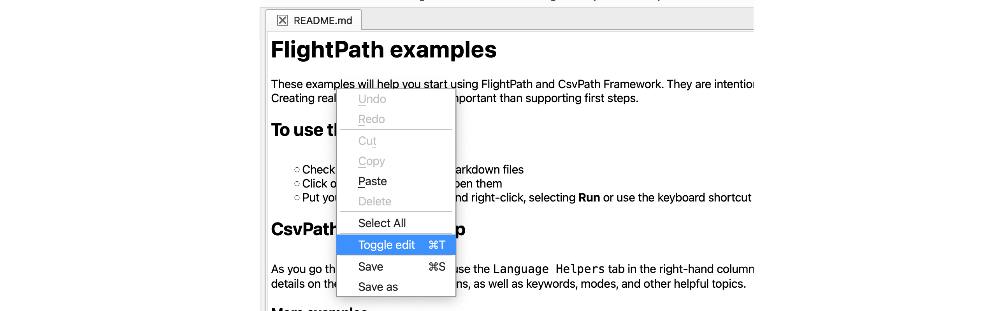

#   Best Practices
{: .no_toc }

### With FlightPath doing preboarding right is the default setting.
{: .no_toc }

{: .highlight }
> For more tips and suggested practices see the Topics section on [csvpath.org](https://www.csvpath.org).

While every file feed data ingestion scenario is different, the practices on this page should straightforward to put into play. Many are specific to FlightPath projects. Others are really just common sense.

- TOC
{:toc}

## Create more, smaller projects

FlightPath Data leans into CsvPath Framework's lightweight approach to organizing work. Spinning up a new project in FlightPath Data takes only a few seconds. Deploying it to FlightPath Server takes only seconds more. Creating more projects is easy. We suggest creating a project per data partner.

The value of working in small projects is:
* Data engineers have fewer chances to step on each other's work
* Configuration is specific to a single context
* Migrating compute closer to the data, or any other major change, affects only one partner at a time
* Data access can be compartmentalized for tighter governance
* Using the archive as a namespace is clearer than having multiple data partners side by side

The potential downside is mainly that configuration changes that apply to multiple data partners have to be made in more places. That can be a significant concern when there are dozens or hundreds of partners. The choice of how fine-grained to make your projects has to be made carefully. But all else being equal, we tend towards small, focused projects.

## Use the defaults

This suggested practice is obvious: when it's a reasonable option, just use the default settings. You gain in consistency, having a complete match to online examples, and good reasons embedded in a particular configuration's default. FlightPath's and CsvPath Framework's defaults are generally sensible.

## Use git to manage named-paths versions

While named-files and run results are versioned, as well as being immutable, named-paths are historic, but not versioned. Every version of a named-file is stored under its SHA256 fingerprint, until it is aged out or for another reason deleted administratively outside of FlightPath. The same is not true of named-paths groups. To be more clear, you can always see past versions of named-paths group csvpath scripts used in runs, but the scripts themselves are not kept in their original form.

This is a considered move. (Though admittedly, a future release might add versions, were there demand). The reason to not store versions immutably is that we expect csvpaths will be stored in a version control system, like any other code.

When you need to see the version of csvpaths used in a run, just look in the manifests. Every csvpath in the run is fully contained there. However, you may need a more granular understanding of changes to your csvpath assets during development. Git is an excellent tool for that, and adding Git to your process, if you don't already use it, is painless.

## Create READMEs in .md files

To state the obvious, documentation is good!

Preboarding projects should be easy and more static than most development work. Once you work out the format, create validations, onboard data partners, and automate, ideally, the project just works until a business partner's contract changes. That means that when you revisit to triage errors, make occasional updates to the rules, etc. it could be hard to pick up where you left off. With good docs that won't be a problem.

You can document your projects in three ways:
* Use Markdown files to write everything down
* Add comments to your csvpaths _(more on this below)_
* And -- also obviously -- break the rules down and write clear, simple csvpaths

Markdown is supported in the editor. To edit `.md` files as text click control-r (command-r on a Mac).

As of 1.1.88, FlightPath automatically creates a Markdown documentation file when you create a named-file or named-paths group — a built-in prompt to document as you go.


<div>Toggle text edit on the context menu or with control-r</div>
{: .caption }

## Use sample files to speed dev

Sadly, in some cases data comes in huge CSV files. That is especially true if the data partner only sends data infrequently. Large files, sometimes many gigabytes, are challenging for reasons of performance. The silver-lining is that in many cases a large file run can continue in FlightPath Server for essentially as long as needed in the background without anyone watching it.

At development time, though, you want quick iterations. We suggest using sample files. FlightPath Data helps you make sample files. Look for the data toolbar that shows when you open a CSV or Excel file, usually positioned at the top of the app.


<div>The data toolbar</div>
{: .caption }

The toolbar helps you create samples of 50 to 5000 lines. It can pick those lines from the top of the file or using random sampling.

## Break csvpaths in to small units

Named-paths groups exist to help you simplify and reuse csvpaths. A named-paths group can have as many csvpaths as you like. Those csvpaths can originate in any number of `.csvpath` files. When you add csvpaths to a group they run as a unit. That means you can treat csvpaths the same as other types of code and break them up into small manageable chunks.

A csvpath file can be added to as many groups as you need. Reuse is easy. You can switch csvpaths with groups on and off using `run-mode`. Other modes can apply other settings on a csvpath-by-csvpath level. And you can use `import()` to include csvpaths in other csvpaths, even from within the same group, for even more reuse.

The benefit is not just reuse. Smaller csvpaths also:
* Are easier to understand and document
* Can take different validation approaches (e.g. OR logic, rather than the default AND)
* Can be easier to map to large validation specifications
* May be used to parallelize runs on very large files or for large numbers of validation rules

## Document and tag your csvpaths

Back to the topic of documentation. Csvpaths can be documented internally using `~ ~` bracketed multi-line text. The same comments external to a csvpath are even more powerful. An external comment comes before or after the csvpath and, in a multi-csvpath file, between the csvpath and the `---- CSVPATH ----` separator.

External comments can have free text, of course. They can also have metadata fields and modes. Metadata fields are user-defined key-value pairs. (The `id:` or `name:` are the exception to metadata fields being user-defined). You can use any one word followed by a colon as the key. The value is every word or symbol (except the colon) until the next key.

User defined metadata fields can be used lots of ways. One way is to tag your csvpaths, in the same way that you might tag a JIRA ticket or an AWS EC2 instance. You can see the metadata fields in FlightPath Server metadata requests, as well as in the FlightPath Data UI.

## Get to know using templates for browsable data

Templates allow you to create directory structures within named-files and run results. The benefits are:
* Organizing data by folder structure makes it easier to browse -- it is human-friendly
* CsvPath Framework references can use full or partial paths to zero in on the desired content
* It helps FlightPath projects meet the expectations of downstream data consumers

The last bullet is often the most important. Every company that takes in data file feeds does preboarding in some fashion. That means CsvPath Framework needs to quickly integrate and/or replicate with whatever organizing structure already exists.

Using templates is not hard, but also not obvious. A template uses the original path of a data file to construct a new path in the named-files staging area or the run results area.

For example, imagine a file landed in an SFTP account with this location:
```
    /data/acme inc/invoices/2025/march/payable-20250301.csv
```
During registration to a named-file called `acme` we might combine that path with a named-file template:
```
    invoices/:3/:4/payables/:filename
```
Doing that, the path within the named-file becomes:
```
    invoices/2025/march/payables/payable-2025031b.csv
```
And we might find it using a reference like:
```
    $acme.files.invoices/2025/march:last
```

The first time you see that example, it's a lot. But the value of learning templates can be huge. If a flat list of file versions within a named-file is enough, you'll know it. In that case, don't bother with using a template. But in many cases the template adds a lot of value or is even a requirement.

## Move compute to data

As you probably know, moving large data from storage to a compute environment can be inefficient and costly. You want to move data as little as possible, especially if it is large.

FlightPath Server is very lightweight. Installing it on a Mac or PC is easy and it can be run as a Windows service. You can also run the server in a container or pod simply by cloning its repo and spinning it up on-demand. In the form of CsvPath Framework, you can embed runs in a cloud function or most any other place Python can run -- examples are available on [csvpath.org](https://www.csvpath.org).

The point is, it is often easy to move the compute close to the data.

## Use fast-forward when not upgrading data

Often times we just need to validate data, not upgrade it or sample it. In those cases, use the `fast_forward_paths` method for your runs. You get all the same metadata, including the validity. You, of course, also get the errors.json, printouts.txt, and variables.json, but without the overhead of streaming results into a data.csv file.

## Limit print statements to errors, warnings, or summary output

The `print()` function is heavy and expensive. Not only does it have to output text, but it also does variable substitution to include references to metadata, headers, and variables. Using it for errors, when you expect relatively few, is not a significant burden. And if your files are only a few megabytes or less, printing is not a big concern. But printing frequently over the lines of a large file can slow down processing a lot.

## Run on INFO -- runs are immutable and idempotent

This one may not be intuitive. Lots of developers and ops people run systems on relatively high logging levels. The reason given is often that when a system problem happens it may be hard to catch or reproduce if the additional log output isn't there. The cost of this improvement to triage is more operational overhead.

FlightPath has that problem less. The reason is that if you encounter a problem during data processing you can rerun at a higher log level with exactly the same results as the first run. Runs are idempotent because the data is immutable. The only catch is that a named-paths group could be updated with new csvpaths. However, even if the group has been updated, the original csvpaths are captured to the run metadata, so they also remain accessible and the link between cause and effect remains.

To be clear, we're talking about system problems, e.g. memory, network, software bugs, etc., not validation errors.Validation error reporting doesn't rely on the system logs, though the logs can sometimes help during validation error triage.

FlightPath Server's run repeatability means that generally you don't have to run on DEBUG in production to be able to understand problems during data processing. The operational benefit may be modest, but it can add up over time.

## Ignore breadth-first runs

The difference between serial runs and breath-first runs is cool and interesting, and each offers subtle advantages.

However, for many purposes, those advantages are so subtle they can be safely ignored. Unless you know you need it, stick with serial runs. To be clear, the basic `collect_paths` and `fast_forward_paths` are fine for most use cases. There's nothing hard about using `collect_by_line` and `fast_forward_by_line`, but why spend the time understanding the difference and what it can do for you, if you don't need it? Go with the serial flow for most things -- it's essentially a sensible default.


<script>
  document.addEventListener("DOMContentLoaded", function () {
    document.querySelectorAll(".nav-list-link").forEach(function (link) {
      if (link.textContent.trim() === "FlightPath Data") {
        link.closest(".nav-list-item").classList.add("active");
      }
    });
    document.querySelectorAll(".nav-list-link").forEach(function (link) {
      if (link.textContent.trim() === "FlightPath Server") {
        link.closest(".nav-list-item").classList.add("active");
      }
    });
  });
</script>


