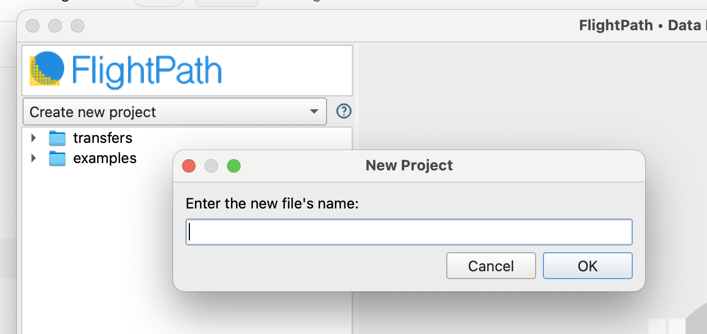

# ✨ Features

### An overview of FlightPath's DataOps features
{: .fs-5  }

* [Project Management](#projects)
* [Editors](/data/editors.html)
* [Profiling and Sampling](/data/profiling.html)
* [Staging Data](/data/staging.html)
* [Configuration](/data/config.html)
* [Validation and Upgrading](/data/validation.html)
* [Help and Documentation](/data/help.html)

# Projects

## Project Management

FlightPath Data helps you manage projects so you can partition data flows for easier development and management. Keeping projects focused on one or a small number of data partnerships makes development more agile and allows you to better use compute resources for higher performance and greater scalability.

When you first open FlightPath the app creates a .`flightpath` JSON configuration file in your home directory that points to your `FlightPath` projects folder. You can change the project folder's location in FlightPath's config panel. Next FlightPath creates a `Default` project. In the `Default` project, as in every new project, you will see an `examples` directory. You can delete the examples if you don't need them.&#x20;

Creating a new project is as simple as selecting `Create New Project` in the drop-down at the top of the right-hand files tree. Each time you create a project in FlightPath, FlightPath creates a new CsvPath Framework project, with a new config file, archive, logs, and other assets. Every project is completely separate, with its own choice of storage backends and integrations.&#x20;

<figure><figcaption></figcaption></figure>

