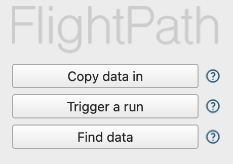

# 🛠️ Getting Started

## 1 - Install FlightPath for MacOS or Windows

<table>
    <tr>
        <td align='center'>
             
            <a href="https://apps.apple.com/us/app/flightpath-data/id6745823097">Apple Mac Store</a>
        </td>
        <td align='center'>
             
            <a href="https://apps.microsoft.com/detail/9P9PBPKZ4JDF">Microsoft Store</a>
        </td>
    </tr>
</table>

{: .highlight }
FlightPath Data is free and open. There is nothing to buy.
[GitHub is also an option](https://github.com/dk107dk/flightpath/tree/main), if you're on a different platform or have special requirements.

## 2 - Explore the built-in examples

<figure><figcaption></figcaption></figure>

When you first open FlightPath the app creates a `.flightpath` JSON configuration file in your home directory that points to your `FlightPath` projects folder, holds variables, and does a few other things. You can change the project folder's location in FlightPath's config panel. Next FlightPath creates a `Default` project. In the `Default` project, as in every new project, you will see an `examples` directory. You can delete the examples if you don't need them.&#x20;

## 3 - Import test data and begin preboarding

<figure><figcaption></figcaption></figure>

Use the `Copy data in` button on the welcome screen to open your operating system's files browser. Remember that if you installed from the MacOS or Windows store you are working in an OS sandbox. The OS sandboxes change how files are stored and who can see them.

## 4 - Dig deeper into CsvPath Framework

There is much more you can do to automate your DataOps preboarding. And there are backend integrations with tools like Grafana, Slack, Zapier, and DataDog. Learn more at <a href='https://www.csvpath.org'>www.csvpath.org <i class="fa fa-external-link" aria-hidden="true" style='vertical-align: super; font-size:13px'></i></a>.

