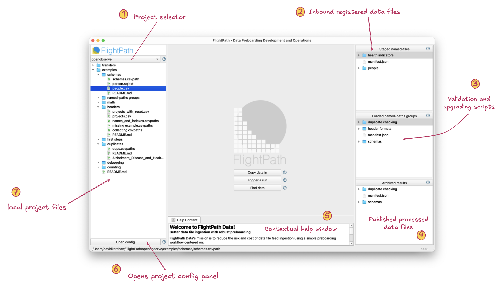
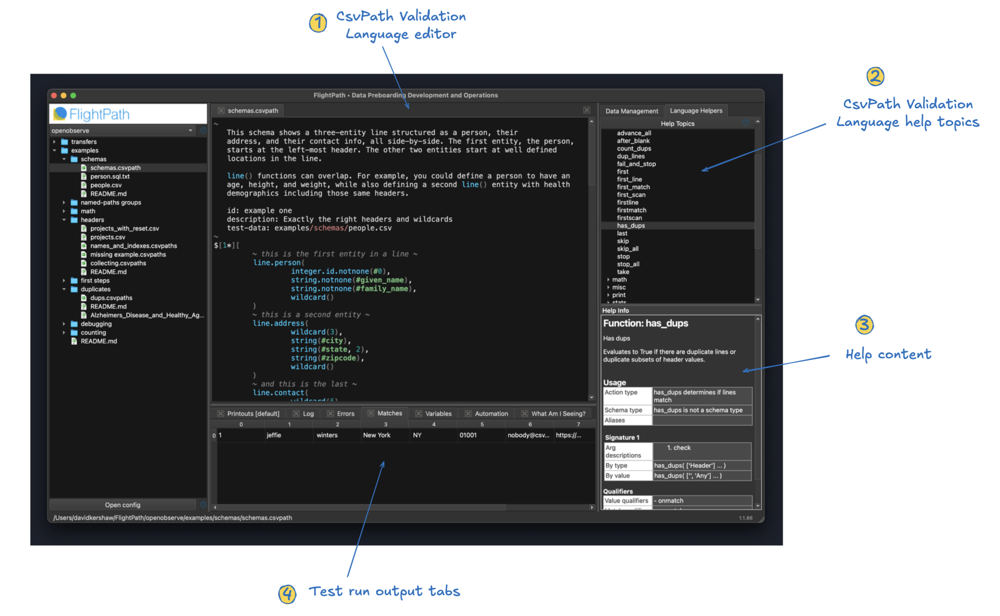
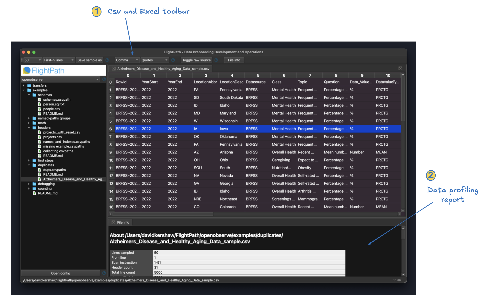
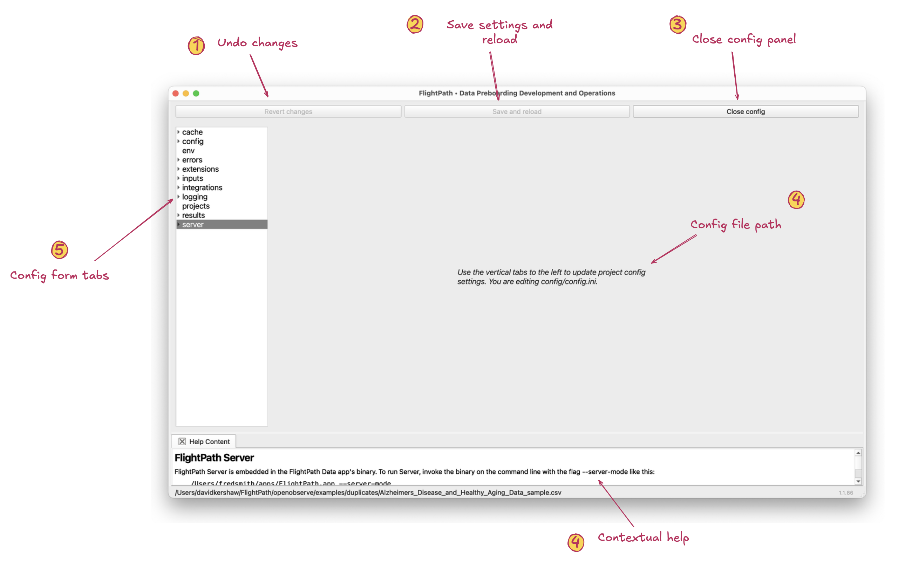

# 🔰 The FlightPath Data UI
{: .no_toc }

### FlightPath Data has an intentionally simple user experience. While preboarding is not simple your tools can be.
{: .no_toc }

FlightPath Data wants you to immediately feel comfortable and able to make things happen. Virtually everything is right where you can see it. There are no deep menus to learn. Help is everywhere. And everything is focused on the mission: land data file feeds with high quality, automation, visibility, and control.

- TOC
{:toc}

{: .highlight }
> FlightPath Data generates extensive examples when it creates a new project.
> If you don't need the help just delete the examples folder.
>
> When you open a csvpath file, the CsvPath Validation Language helper windows
> open on the right side of the app.
>
> And anywhere you see  click to open the contextual
> help window at the bottom center of the app.

## Home

This is your first view of FlightPath Data

{: .caption }
1. <b>Project selector</b>. FlightPath Data works in projects, typically one per data partner. Each project has the same structure and each has examples to get you started. There is no limit on the number of projects.
1. <b>Inbound registered files</b>. This window shows you the registered files for this project. It may be a remote view on production or just test files for a local dev project.
1. <b>Validation and upgrading</b>. These are csvpath scripts that have been loaded to do the validation and upgrading of registered files in runs.
1. <b>Published data files</b>. Run results appear in this window. The like the registered files window this area is immutable. Once results files are created they are never changed.
1. <b>Contextual help</b>. Everywhere you see the   icon click to open this help and feedback window and see explanations that are specifically about what you are currently trying to do.
1. <b>Open project config</b>. This button opens the project config. FlightPath Data manages a config file for every project that locates the registered files, environment variables, etc. There are essentially no config setting for FlightPath Data itself.
1. <b>Local project files</b>. This window is a local file tree showing your current project's files. Most of these files will be csvpath and Csv and Excel files. You will also work with JSON files for metadata and markdown files for project documentation.

## Csvpath Editing

FlightPath Data editing a csvpath file in dark mode

{: .caption }
1. <b>Validation Language editor</b>. FlightPath Data is primarily about two things: validation and upgrading and data preboarding pipelines. The csvpath editor helps you create validation and upgrading scripts quickly. It has CsvPath Validation Language syntax highlighting, context menu input help, and the ability to do test runs from the context menu or using control-R.
1. <b>Help topics</b>. While the syntax of CsvPath Validation Language is simple, it has over 150 functions and many csvpath-level configuration options. This window provides a comprehensive help tree for the language, configuration, and metadata options.
1. <b>Help content</b>. Help content you select in the tree above shows up here. You can, of course, open this window as large as you like.
1. <b>Test run results tabs</b>. You can run CsvPath Framework pipelines on-demand within FlightPath Data. But in development, the quickest way to iterate is to do simple test runs. When you hit control-R or select `Run` on the context menu your results open in the help and feedback window. Your test runs generate most of the same result assets that running a full pipeline process would:
<ul style='margin-left:40px'>
    <li/> Matched or unmatched lines
    <li/> Errors JSON
    <li/> Metadata and runtime indicators JSON
    <li/> Log output
    <li/> Printouts
    <li/> Example automation code
    <li/> A comprehensive breakdown of why the results are what they are
</ul>

## Csv and Excel Files

FlightPath Data helps you explore, profile, and sample tabular data files

{: .caption }
1. <b>CSV and Excel toolbar</b>. The CSV and Excel toolbar helps you understand and sample your data files. It includes features for:
<ul style='margin-left:40px'>
    <li/> Creating samples of large files, including random samples
    <li/> Configuring the delimiter and quote chars used in a file
    <li/> Toggle to see raw source (CSV only)
    <li/> Trigger a data profiling report
</ul>

1. <b>Data profiling report</b>. The report gives you an overview of the contents of the data file based on a sample. It includes:
<ul style='margin-left:40px'>
    <li/> Headers and header indexes
    <li/> Line and blank line counts
    <li/> Count of duplicate lines and lines with blank header values
    <li/> Assess if headers hold distinct values
    <li/> Number of unique values per header seen
    <li/> Assessed types seen
    <li/> For numbers, a range min and max
    <li/> If the header value can be None
</ul>

_Please remember, FlightPath Data is not a CSV editor. It is an environment for developing automated data preboarding pipelines using CsvPath Validation Language. Why does it not offer CSV editing? One reason is that data preboarding involves Excel and other files that have very different requirements. Another reason is that there are many capable tools for editing text files and CSV files available. We assume the world doesn't need another one. But if there is demand, FlightPath Data may expand its capabilities in that direction in the future._

## Config panel

The find data dialog helps you find registered files and run results

{: .caption }
1. <b>Rollback config changes</b>. Before you save and reload the config you can roll back your change by clicking this button.
2. <b>Save and reload project config</b>. Clicking this button save your config and reloads the project with the new settings. If, for instance, your archive was in the local file system but you changed the config so that it is in S3, clicking this button will save your config change and your archive window will update to show you the S3 files.
3. <b>Close config panel</b>. If you haven't modified your config, this button allows you to save it. If you have modified it, you must save and reload or roll back your changes before closing the config panel.
4. <b>Path to config file being updated</b>. When you open the config panel this message points out which physical config file you are updating. If you prefer to make config changes in the project's config.ini you are welcome to do that.
5. <b>Config form tabs</b>. These vertical tabs open the forms you use to configure your project.

