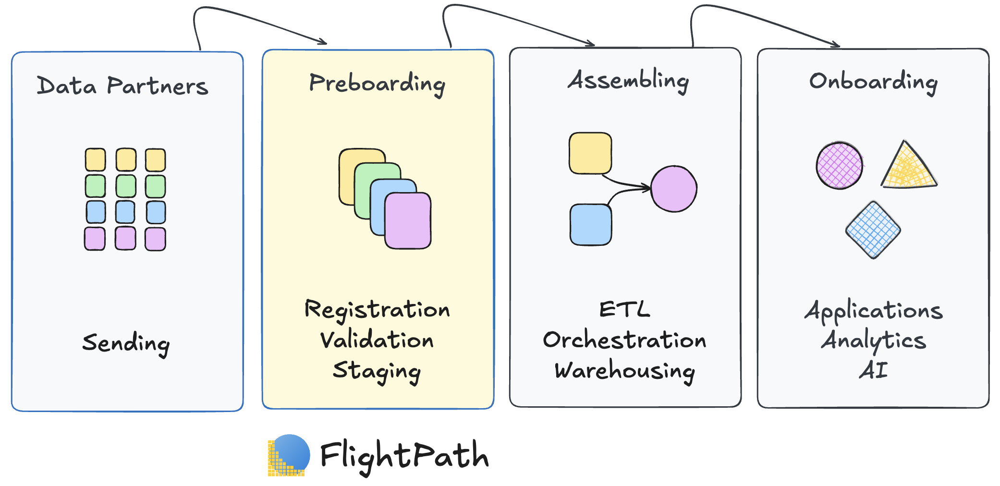
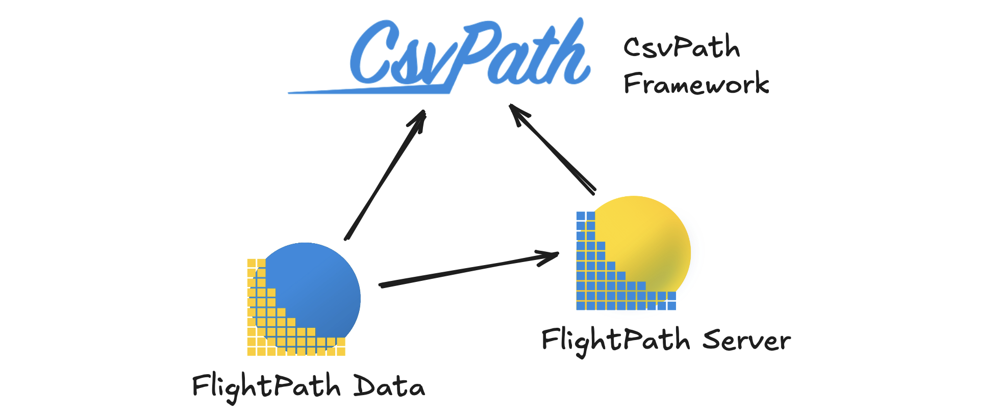
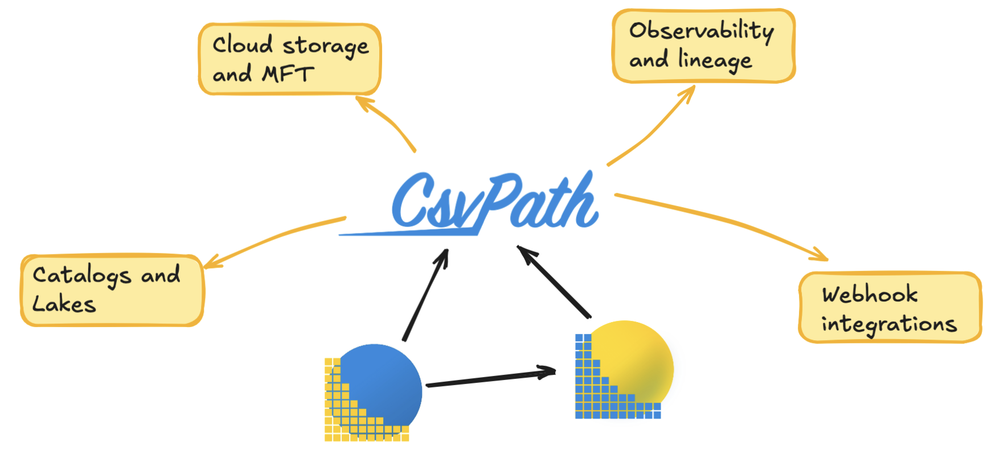

---
# Feel free to add content and custom Front Matter to this file.
# To modify the layout, see https://jekyllrb.com/docs/themes/#overriding-theme-defaults

title:  How FlightPath Works
layout: home
parent: FlightPath Data
nav_order: 2
description: "FlightPath Data and CsvPath Framework are a complete architecture for data file feed management and ingestion. "
permalink: /architecture.html
---

#   The Architecture For Receiving Data Files

## Preboarding Within The Data Lifecycle
Preboarding is an integral part of the flow of data files from untrusted producers to data product end users. FlightPath Data and FlightPath Server are the architecture for effective data preboarding.

<figure style='text-align:center'><figcaption></figcaption></figure>

## Purpose-built components, state of the art integrations

FlightPath Data, FlightPath Server, and the CsvPath Framework together take data file feed ingestion to the next level. The solution is developer-friendly, AI-driven, opinionated, and flexible, keeping system design effort low. Not only do the components build on one anther, they also support the leading clouds, observability, data management, and notification tools you already use.

### Architecture Components
{: .no_toc }
FlightPath Data augments CsvPath Framework to create a complete low-code, high-function preboarding system for ingesting data file feeds. The architecture has two layers: core components and enabling integrations.

#### CsvPath Framework
{: .no_toc }
* Data and metadata management for file feeds
* CsvPath Validation Language for validation and upgrading
* CsvPath Reference language for querying staged data and results
* Event-driven integrations

#### FlightPath Data
{: .no_toc }
* A project-based AI-powered IDE for validation and upgrading
* A CsvPath Framework production management console
* A project configuration and syncing tool

#### FlightPath Server
{: .no_toc }
* A multi-project runtime for production FlightPath deployments
* An no-code integration target for managed file transfer systems
* A trusted publisher serving known-good data to downstream consumers

<figure style='text-align:center'><figcaption></figcaption></figure>

#### Enabling Integrations
{: .no_toc }

Preboarding is just one stop on data's journey from source to consumer. FlightPath Data and CsvPath Framework integrate with data file sources and destinations, observability platforms, and metadata-layer collaborators.

* Five supported MFT and data lake storage backends: AWS, Azure, GCP, SFTP, and file system
* Metadata capture to any mainstream relational database
* Arms-length integrations using webhooks and APIs
* Support for sending data processing events to OpenTelemetry and OpenLineage platforms

<figure style='text-align:center'><figcaption></figcaption></figure>

