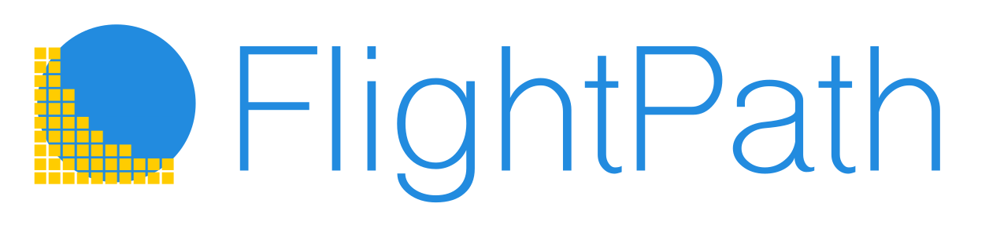

---
# Feel free to add content and custom Front Matter to this file.
# To modify the layout, see https://jekyllrb.com/docs/themes/#overriding-theme-defaults

title: FlightPath Data
layout: home
nav_order: 2
description: "FlightPath Data is a DataOps tool for data preboarding that helps you bring external tabular datasets into the enterprise with confidence, efficiency, and quality. "
permalink: /flightpath.html
---

    
    <h1>The power frontend for CsvPath Framework</h1>
    <h3 class='fs-5 move-up'>Land tabular enterprise data with confidence, efficiency and quality</h3>
     
    

        FlightPath Data is open, free, and cross-platform. Find it on the
        <a href='https://apps.apple.com/us/app/flightpath-data/id6745823097?mt=12'>Apple MacOS Store</a>,
        the <a href='https://apps.microsoft.com/detail/9P9PBPKZ4JDF'>Microsoft Store</a>,
        or on <a href='https://github.com/dk107dk/flightpath/tree/main'>GitHub</a>.
    

    

        
        

            
<a href='https://apps.apple.com/us/app/flightpath-data/id6745823097?mt=12'><i class="fab fa-apple"></i> Apple MacOS Store</a>

            
<a href='https://apps.microsoft.com/detail/9P9PBPKZ4JDF'><i class="fab fa-windows"></i> Microsoft Store</a>

        

    

# Development and Operations

Preboarding data file feeds before they land in your data lake, applications,
or analytics lowers risk and reduces costs. <a href='https://www.csvpath.org'>CsvPath Framework</a>
is the leading data preboarding infrastructure.

FlightPath Data supports both a development and operations. It makes development more agile by:

* Helping you spin up preboarding projects quickly
* Providing examples and guardrails
* Minimizing configuration tasks, and
* Providing in-context help.

On the DataOps operations side, FlightPath makes you more effective by:

* Helping you find data
* Tracing how data changes version-to-version and run-to-run
* Quickly staging files and loading named-paths groups, and
* Assisting you in creating references and templates to match your operating requirements

# Infrastructure and Integrations

FlightPath runs on MacOS and Windows 11. It supports all the same infrastructure backends that CsvPath Framework does. The storage backends are:

* AWS S3
* Azure Blob Storage
* Google Cloud Storage
* SFTP servers
* Locally mounted file systems

FlightPath makes it easy to configure CsvPath Framework's integrations, including Slack, OpenTelemetry, OpenLineage, webhooks, and more.

# Quick links
💡 [Preboarding For Success](preboarding.html)

✨ [FlightPath Features](features.html)

### Get Started!

When you open FlightPath a default project is automatically created. FlightPath generates a set of simple examples in every project to help you get going.

The examples show you how to write CsvPath Language and deploy it to the CsvPath Framework. FlightPath also has in-context help for every feature and a documentation window that guides your use of CsvPath Framework capabilities.

