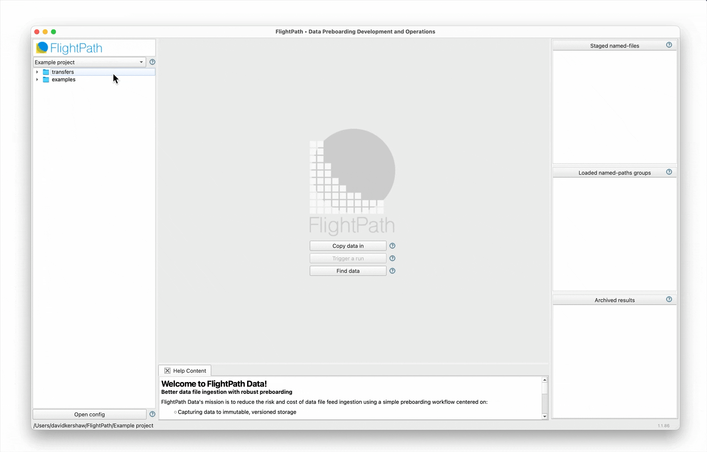

---
# Feel free to add content and custom Front Matter to this file.
# To modify the layout, see https://jekyllrb.com/docs/themes/#overriding-theme-defaults

title: FlightPath Data
layout: home
nav_order: 1
description: "FlightPath Data is a DataOps tool for data preboarding that helps you bring external tabular datasets into the enterprise with confidence, efficiency, and quality. "
permalink: /flightpath.html
---

    
    <h1>AI-assisted Edge Data Governance</h1>
    <h3 class='fs-5 move-up'>
            Land enterprise data file feeds with confidence, efficiency and quality.
                 Before you ingest data, be sure it's the right data and it's ready.

    </h3>

    

        
        

    

Get FlightPath Data
  native binaries or download from <a href='https://github.com/dk107dk/flightpath/tree/main'>GitHub</a>.
    

            
<a href='https://apps.apple.com/us/app/flightpath-data/id6745823097?mt=12'><i class="fab fa-apple"></i> Apple MacOS Store</a>

            
<a href='https://apps.microsoft.com/detail/9P9PBPKZ4JDF'><i class="fab fa-windows"></i> Microsoft Store</a>

        

    

# The Problem

Arriving data files are often handled in a way that muddies their identity and contents and leaves their validity up in the air. Fixing these problems is expensive and, perversely, the fixes often muddy the water more. Some data errors are finally caught downstream, well after ingestion. And those errors are the hardest to find, explain, and remediate.

The solution is to handle data files correctly at the point they first enter the enterprise. We call this data preboarding.

# Development, BizOps, and TechOps

FlightPath preboarding process captures CSV, JSONL, and Excel file at the edge and presents versioned, valid, and cleaned up data to downstream workflows, data lakes, applications, analytics, and AI.

FlightPath Data supports three teams: Development, BizOps, and IT.

▶ It makes the Development team more agile by:

* Push-button **consistent preboarding projects**
* **AI tools for generating validations** from English-language requirements
* **Data profiling** in development pipelines
* **low-code integrations** and a lightweight **server environment**
* Coding agents for **refactoring and test data generation**

▶ BizOps team members use productivity-boosting AI tools to:

* **Explain and document validation rules**
* **Convert business documents** to production scripts

▶ FlightPath makes TechOps more effective by:

* **Automating manual** data management processes
* Quickly **staging data** and loading **validation and upgrading** scripts
* Managing **immutable versions** and easily finding point-in-time data
* Connecting systems and storage with **no-code and low-code integrations**
* Tracing data change with **lineage and operational metadata**

# Infrastructure and Integrations

FlightPath runs on MacOS and Windows 11. It supports all the same infrastructure backends that CsvPath Framework does. The storage backends are:

* AWS S3
* Azure Blob Storage
* Google Cloud Storage
* SFTP servers
* Locally mounted file systems

FlightPath makes it easy to configure CsvPath Framework's integrations, including Slack, OpenTelemetry, OpenLineage, webhooks, and more.

# Quick links
💡 [Preboarding For Success](preboarding.html)

✨ [FlightPath Features](features.html)

### Get Started!

When you open FlightPath a default project is automatically created. FlightPath generates a set of simple examples in every project to help you get going.

The examples show you how to write CsvPath Language and deploy it to the CsvPath Framework. FlightPath also has in-context help for every feature and a documentation window that guides your use of CsvPath Framework capabilities.

