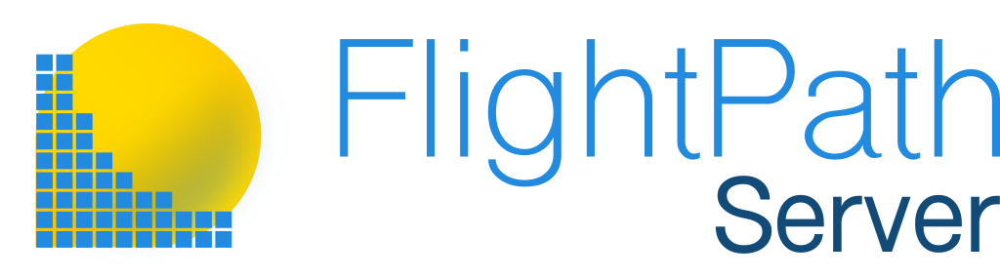

    
    <h1>The production runtime for FlightPath Data projects.
</h1>
    <h3 class='fs-5 move-up'>

    </h3>
    

FlightPath Server is bundled with FlightPath Data. Download
  native binaries.
    

            
<a href='https://apps.apple.com/us/app/flightpath-data/id6745823097?mt=12'><i class="fab fa-apple"></i> Apple MacOS Store</a>

            
<a href='https://apps.microsoft.com/detail/9P9PBPKZ4JDF'><i class="fab fa-windows"></i> Microsoft Store</a>

<!--div style='text-align:center;'>

FlightPath Server is open, free, and cross-platform. It is bundled with FlightPath Data. When you install FlightPath Data the server is also installed. Download  from the Apple MacOS Store or the Microsoft Store.

        
<a href='https://apps.apple.com/us/app/flightpath-data/id6745823097?mt=12'><i class="fab fa-apple"></i> Apple MacOS Store</a>

        
<a href='https://apps.microsoft.com/detail/9P9PBPKZ4JDF'><i class="fab fa-windows"></i> Microsoft Store</a>

</div-->

## What Is FlightPath Server?
FlightPath Server is a REST API that enables you to automate inbound CSV, JSONL/NDJSON, and Excel file data preboarding. It applies quality and governance controls, and stages them for downstream consumers. FlightPath Server runs the preboarding workflows you build in FlightPath Data in a multi-user, multi-project production environment, without manual intervention.

With FlightPath Server you can:

▶ **Automate data arrival**: Activations trigger runs when files land, with no scheduling or polling required  
▶ **Apply schemas and rules at scale**: Minimize manual processing and eliminate ad-hoc data checking  
▶ **Connect MFT**: Creates a no-code path from MFT (managed file transfer) to data lakes and applications via a trusted, known-good data publisher  
▶ **Notify downstream automatically**: Trigger webhooks on run outcomes, among other no-code integration options.  
▶ **Trace problems and clarify data flows**: Every run generates lineage and ops metadata that can be shared via OpenTelemetry or OpenLineage.  
▶ **Stage versioned, upgraded, well-identified data**: The organization's edge has never been so well governed.

Combined with FlightPath Data, onboarding a new data partner goes from weeks to days. Projects deploy to Server in minutes from the same environment you used to build them.

## Bundled with FlightPath Data

There is no separate install. FlightPath Server is a lightweight binary that is easy to deploy.
It is designed to be running before you've finished your coffee:

## Move Fast, Achieve Stuff
Simple REST JSON API that fits most upstream and downstream tools without custom adapters
Projects deploy from FlightPath Data in minutes — the same config you tested locally runs in production unchanged
Config variable interpolation keeps secrets cleanly separated from runtime configuration, making multi-environment deployments straightforward

## Infrastructure and Integrations
FlightPath Server runs as a native binary on MacOS and Windows 11, as a Windows service, or on any platform from the GitHub repo as a Python server. Its supported storage backends are:

▶ AWS S3  
▶ Azure Blob Storage  
▶ Google Cloud Storage  
▶ SFTP servers  
▶ Locally mounted file systems

FlightPath Data makes it easy to configure CsvPath Framework integrations including Slack, OpenTelemetry, OpenLineage, webhooks, and more.

