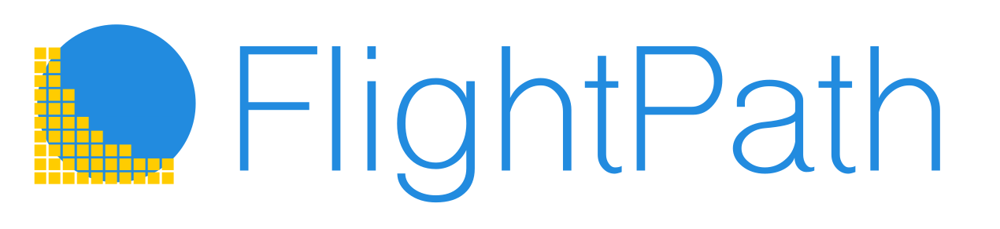

---
# Feel free to add content and custom Front Matter to this file.
# To modify the layout, see https://jekyllrb.com/docs/themes/#overriding-theme-defaults

title: FlightPath Data
layout: home
nav_order: 1
description: "FlightPath Data is a DataOps tool for data preboarding that helps you bring external tabular datasets into the enterprise with confidence, efficiency, and quality. "
permalink: /
---

### Land tabular enterprise data with confidence, efficiency and quality
{: .fs-5 .move-up }

# The power frontend for CsvPath Framework

Preboarding inbound tabular data before it lands in your data lake, applications, or analytics lowers risk and reduces frustration and costs. [CsvPath Framework](https://www.csvpath.org) is the leading data preboarding infrastructure and FlightPath is the way to turbo charge it.

FlightPath is open, free, and cross-platform. Find it on the [Apple MacOS Store](https://apps.apple.com/us/app/flightpath-data/id6745823097?mt=12), the [Microsoft Store](https://apps.microsoft.com/detail/9P9PBPKZ4JDF), or on [GitHub](https://github.com/dk107dk/flightpath/tree/main).

# Development and Operations

FlightPath is both a development and an operations tool. It makes development more agile by:

    Helping you spin up preboarding projects quickly

    Providing examples and guardrails

    Minimizing configuration tasks, and

    Providing in-context help.

On the DataOps operations side, FlightPath makes you more effective by:

    Helping you find data

    Tracing how data changes version-to-version and run-to-run

    Quickly staging files and loading named-paths groups, and

    Assisting you in creating references and templates to match your operating requirements

# Infrastructure and Integrations

FlightPath runs on MacOS and Windows 11. It supports all the same infrastructure backends that CsvPath Framework does. The storage backends are:

    AWS S3

    Azure Blob Storage

    Google Cloud Storage

    SFTP

    Locally mounted file systems

FlightPath makes it easy to configure CsvPath Framework's integrations, including Slack, OpenTelemetry, OpenLineage, webhooks, and more.

# Quick links
💡Preboarding For Success
✨FlightPath Features

### Get Started

When you open a FlightPath a default project is automatically created. As in every project, FlightPath generates a set of simple examples that show you how to write CsvPath Language and deploy to the CsvPath Framework. FlightPath also has in-context help for every feature and a documentation window that helps guide your use of CsvPath Framework capabilities.

