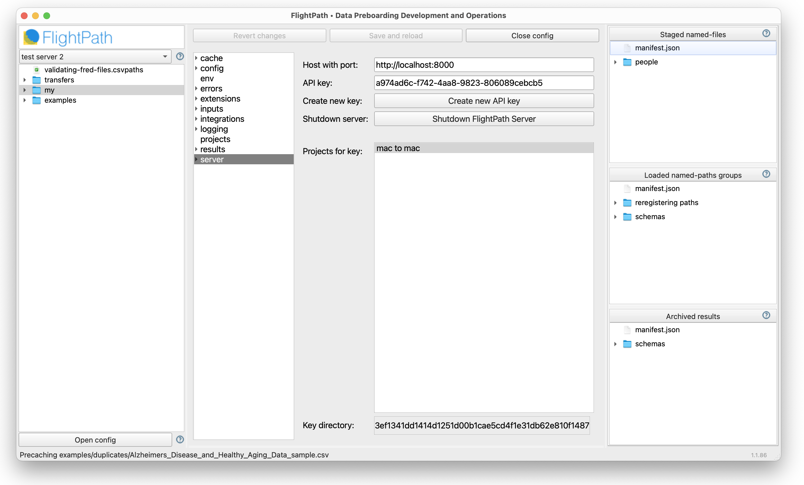
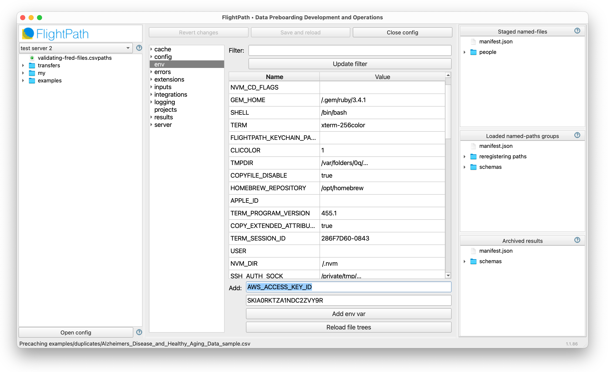
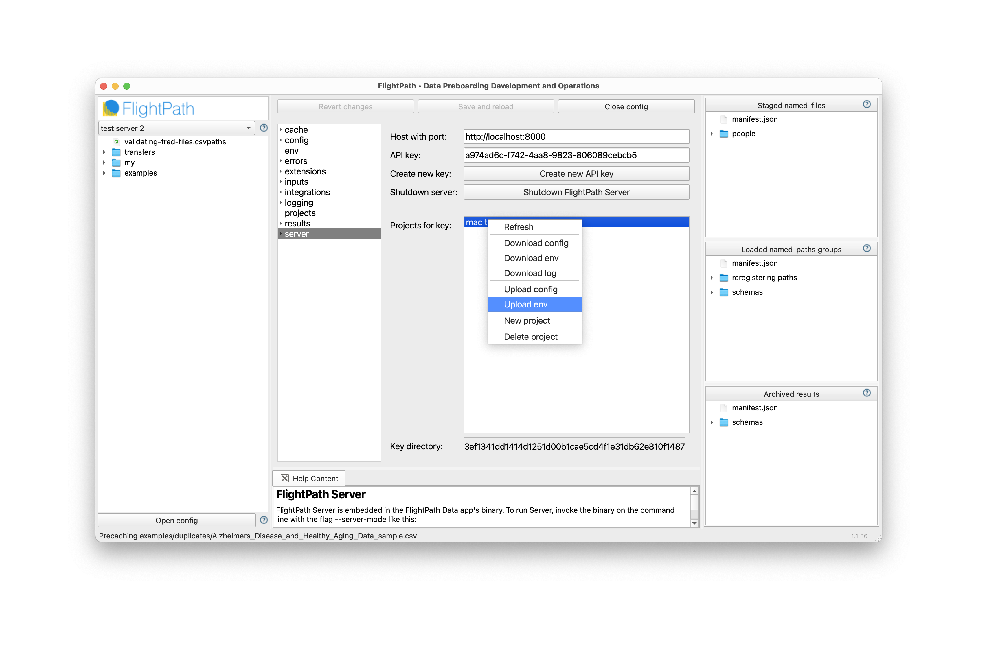
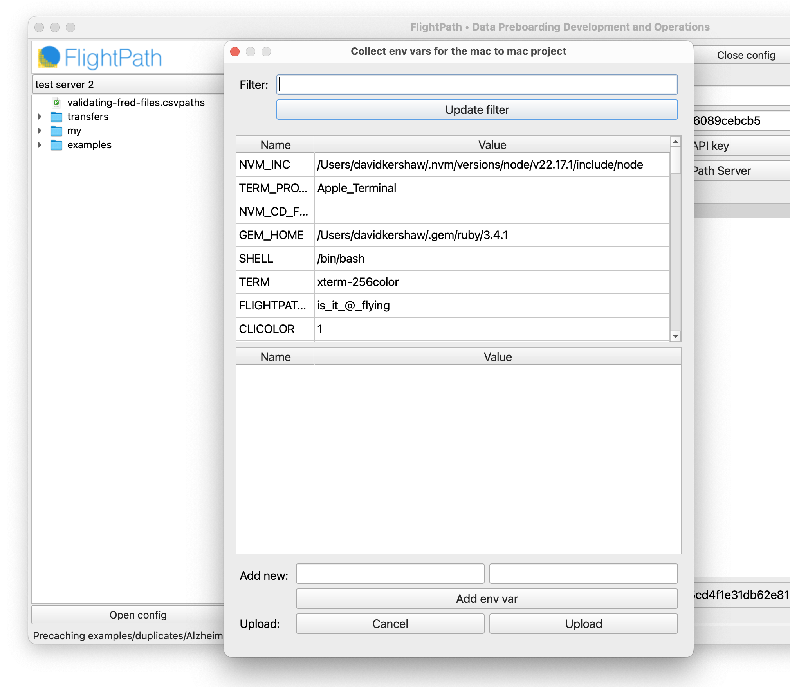
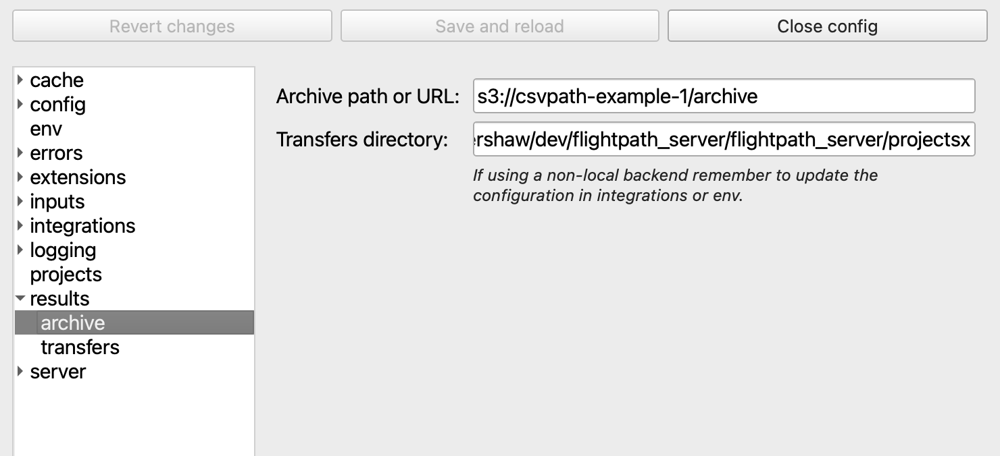

# ⚙️  Use Cases: Creating the Bronze Layer
{: .no_toc }

## A bronze layer partition for "ideal-form" raw data files
{: .no_toc }
Olympic medal tiers, bronze, silver, and gold, are a simplifying conceptual organization for a data lake. Most data lakes require more nuance and design than simple metal tiers convey. One aspect to decide is, where do raw data files go and how much validation and upgrading do they require? With CsvPath Framework you have two types of raw data:
* Data as it arrives
* Data after validation

Data in its arrival form is staged in the immutable named-files data storage area. Those files are considered untrustworthy because they are not validated and have no guarantees as to form or content. Data after validation is known-good or known-bad. If it has been upgraded to a certain standard it is "ideal-form" raw data.

In designing how your data lake and CsvPath Framework work together you have two main options:
* Publish ideal-form known-good data from FlightPath Server to the downstream data lake
* Locate one or more project archives within the storage space demarcated for bronze layer assets

The first option is the trusted publisher model. In this approach FlightPath Server acts as an intermediary between an untrustworthy external data partner and the protected data lake. It requires a workflow process to pull data from FlightPath Server and push it into the data lake. Most data lakes already have such a workflow tool in the form of an ETL system or a process orchestrator. Alternatively, CsvPath can push data to file shares or SFTP servers, as well as storing it in the project's immutable archive.

The second option is even simpler. In this case, you simply create a space in your bronze layer that one or more FlightPath Server projects can write their archives to. If your data lake includes files, as most do, the area for storing files is generally in one of the storage backends CsvPath Framework supports:
* Windows or POSIX filesystems
* SFTP accessible storage
* S3 buckets
* Azure blobs
* Google Cloud Storage buckets

A FlightPath Server project is a server-hosted CsvPath Framework project with a few limitations accommodating a multi-user, multi-project environment, but basically all the same capabilities you are used to. Pointing the archive at a storage backend is easy. Using FlightPath Data to create the configuration and upload it the server makes it even easier.

## Example steps in S3
{: .no_toc }

- TOC
{:toc}

### Create a bucket and provision access

There are several considerations in creating a bucket as part of a data lake and providing access. That is beyond the scope of this page. For our purposes, let's keep it simple and assume the bucket exists and there is a service account with keys for access. These steps are on the S3 side.

Open FlightPath Data. Click the Config tab and when Config opens click on `server` in the vertical tabs. You should see your FlightPath Server host, key, and projects. If you don't, <a href=''>read here to set up FlightPath Server</a>.

FlightPath Data configures FlightPath Server using the Config panel

{: .caption }

### Add keys to the project env
CsvPath Framework config uses .ini values and OS environment variables. FlightPath Data, additionally, stores env vars local to the app and loads them at each launch, so that your OS env vars are predictable across application sessions. FlightPath Server takes that a step further by locating all env vars in a protected project env file. This isolates the project from the OS env var environment, adding security and predictability.

In FlightPath Data, click on the Config panel's `env` tab to add the secret key and access key to the project env vars.

Environment variables are set in a FlightPath Data project and uploaded to FlightPath Server

{: .caption }

### Upload env vars to the server project

In FlightPath Data you configure a local project and then sync it up to a server project. We have our AWS env vars, so switch back to the server tab. Right-click your project name and select `Upload env`. This process creates a server project env variable JSON file that is private to the project. The server project env vars are never part of the regular OS env vars.

After the upload, the AWS bucket is accessible to the project.

{: .caption }

The env upload form is a click-to-pick menu of the env vars available in your FlightPath Data project. You can also add vars to your server env that are not added to your local project env. When you have the set of vars you need, click upload to push them to your FlightPath Server project.

The env var upload form lets you quickly pick and load a custom set of env vars for your server project

{: .caption }

### Position your archive

With AWS ready, we now set the location of the project's archive to a path in the bucket. To do that, click on `results` and set the desired path in the archive field. The URL must be in the form `s3://bucket-name/path/to/archive`. Then, as the final step, head back to `server`, right-click on the project name and select `Upload config`.

Your FlightPath Server project is now sending runs to the archive in the bronze layer of your S3 data lake.

After uploading the config, the project archive is live on S3.

{: .caption }

