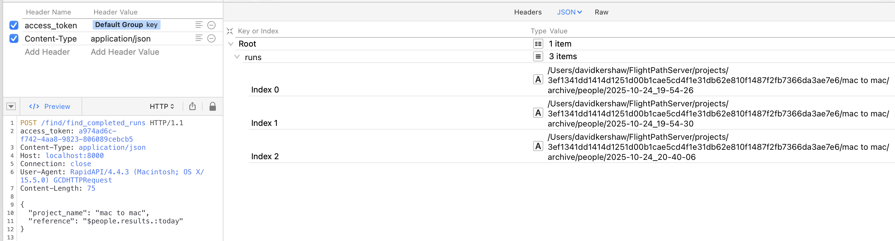
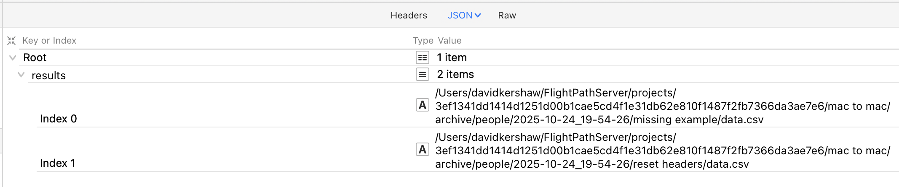
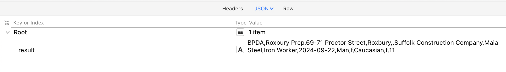
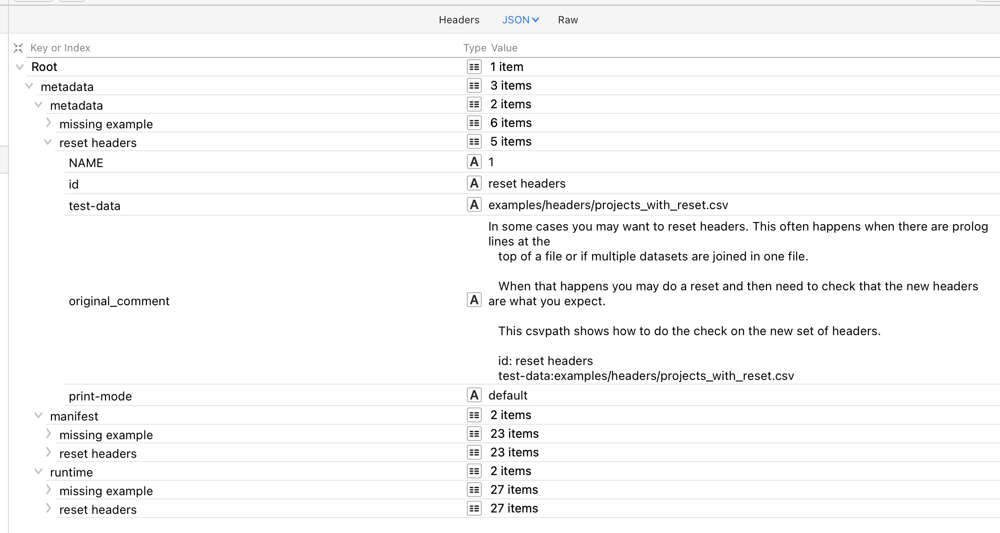

# ⚙️  Use Cases: Finding Results From Downstream
{: .no_toc }

## Downstream data consumers
{: .no_toc }

Downstream data consumers are the systems that receive data file feeds from data partners. Preboarding is the first step in downstream consumers ingesting new data. FlightPath Server intermediates between an untrustable data partner and its downstream consumer. It is a publisher of trustworthy data.

To find data in a FlightPath Server project's archive you can call several endpoints:

<table>
    <tr>
        <td>
<a href='#find-runs'>/csvpath/find_completed_runs</a>
        </td>
        <td>
Finds the run directories of completed runs using a reference. References are path-like queries that identify various types of information in CsvPath Framework, including runs.
        </td>
   </tr>
    <tr>
        <td>
/csvpath/get_run_path
        </td>
        <td>
Gets the fully qualified path to a run directory
        </td>
   </tr>
    <tr>
        <td>

<a href='#find-results-admin-webapp'>/find/find_results</a>
        </td>
        <td>
Lists the results of a particular run. Each run has one or more csvpath statements. Each statement creates a result of the run.
        </td>
    </tr>
    <tr>
        <td>
<a href='#find-result-admin-webapp'>/find/get_result</a>
        </td>
        <td>
Gets the data content of a specific result within a particular run.
        </td>
    </tr>
    <tr>
        <td>
/csvpath/get_run_errors
        </td>
        <td>
Gets the aggregated errors collected for all results in a run as a JSON file.
        </td>
    </tr>
    <tr>
        <td>
<a href='#get-run-metadata'>/csvpath/get_run_metadata</a>

        </td>
        <td>
Gets the metadata collected for all results in a run as a JSON file. The JSON structure is according to result and type of metadata.
        </td>
    </tr>
    <tr>
        <td>
/csvpath/get_run_variables
        </td>
        <td>
Gets the aggregated variables collected for all results in a run as a JSON file.
        </td>
    </tr>
    <tr>
        <td>
/csvpath/get_run_printouts
        </td>
        <td>
Gets the aggregated printouts collected for all results in a run as a JSON file.
        </td>
    </tr>
</table>

## Options
{: .no_toc }

- TOC
{:toc}

### Find runs
You can look up runs flexibly using references based on the named-paths group used. A named-paths group is a set of one or more csvpath statements that are applied to a registered file. References have the form:
```bash
    $groupname.results.limiter-one.limiter-two
```
`Groupname` is the named-paths group. `results` indicates that we're looking for results, as opposed to files, variables, or another data type. `limiter-one` and, optionally, `limiter-two` indicate which results within the group you are looking for.

The limiter can be:
* A date or partial date in the form: `YYYY-MM-DD_HH-MM-SS`
* A storage path that is relative to the group name
* 0-2 tokens in the form of a colon followed by:
    * today
    * yesterday
    * before
    * after
    * first
    * last
    * all
    * _index_ (a number from 0-n)
* In the case of the second limiter, the identity of a csvpath in the group
* A colon followed by:
    * data
    * unmatched

Using references you can easily find sets of runs or a single run. And within a single run you can look specifically at the results of a single csvpath. To learn about references and create them quickly and easily have a look at the FlightPath Data's find data dialog. The button for the dialog is in the center of the Welcome screen.


<div>Finding today's runs.</div>
{: .caption }


### Find results [admin webapp](http://localhost:8080/web/admin)

<div>Listing the results of a specific run. Each result is the output of a csvpath.</div>
{: .caption }

### Find result [admin webapp](http://localhost:8080/web/admin)
CsvPath Validation Language gives you several options for how to validate files. When a csvpath statement is applied to a file it will match lines. That means, every line that results in the csvpath statement returning `True` is a match.

You have the option to make invalid lines match. More typically, matching lines are considered to be valid. If you have CsvPath Framework collect matching lines, it will save them in a file called `data.csv`. You can also have the Framework also save unmatched lines in a file called `unmatched.csv`. This endpoint gives you access to those files.


<div>Pulling the data generated by a csvpath in a run. The data is the set of all lines that matched the csvpath.</div>
{: .caption }

### Get run metadata
FlightPath gives you access to all the metadata CsvPath Framework generates during a run. Some of that metadata is in the form of errors, variables, and printouts, each with their own endpoint. Three closely related types of metadata are packaged up together by the get metadata endpoint. The three types are:
* User defined metadata fields and any run instructions
* The csvpath's run manifest
* Runtime indicators for the csvpath

The first of these is two things:
* Run instructions in the form of operation modes applied to the individual csvpath
* User-defined metadata fields
A user-defined field is essentially documentation. They work like tags do in tools like the AWS console or JIRA. You place metadata fields on a csvpath by adding a name-colon as the key and free text as the value. For e.g.:
```
    description: this is a csvpath I wrote as a test
```
The modes look the same, but are actually instructions to the Framework for how you want the csvpath run to work. You can tell the Framework to OR parts of your statement, rather than AND them, disable the csvpath, change the way errors are handled, and several other things. Modes allow you to override project-wide settings.

The manifest captures all the information about the run, its data, and the csvpath. It is the information you would use for identification, forensics, and discovering the data from downstream.

The runtime indicators are a set of fields that tell you the final state. They include line and match counts, validity, completeness, headers, etc. The indicators are updated line-by-line and are available to the csvpath writer's print statements during the run.


<div>CsvPath Framework generates a lot of metadata about each run. This endpoint provides access to it.</div>
{: .caption }

<script>
  document.addEventListener("DOMContentLoaded", function () {
    document.querySelectorAll(".nav-list-link").forEach(function (link) {
      if (link.textContent.trim() === "FlightPath Data") {
        link.closest(".nav-list-item").classList.add("active");
      }
    });
    document.querySelectorAll(".nav-list-link").forEach(function (link) {
      if (link.textContent.trim() === "FlightPath Server") {
        link.closest(".nav-list-item").classList.add("active");
      }
    });
  });
</script>


