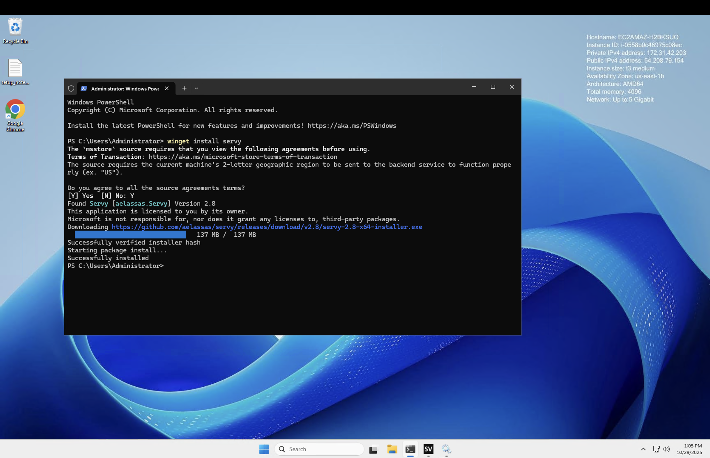
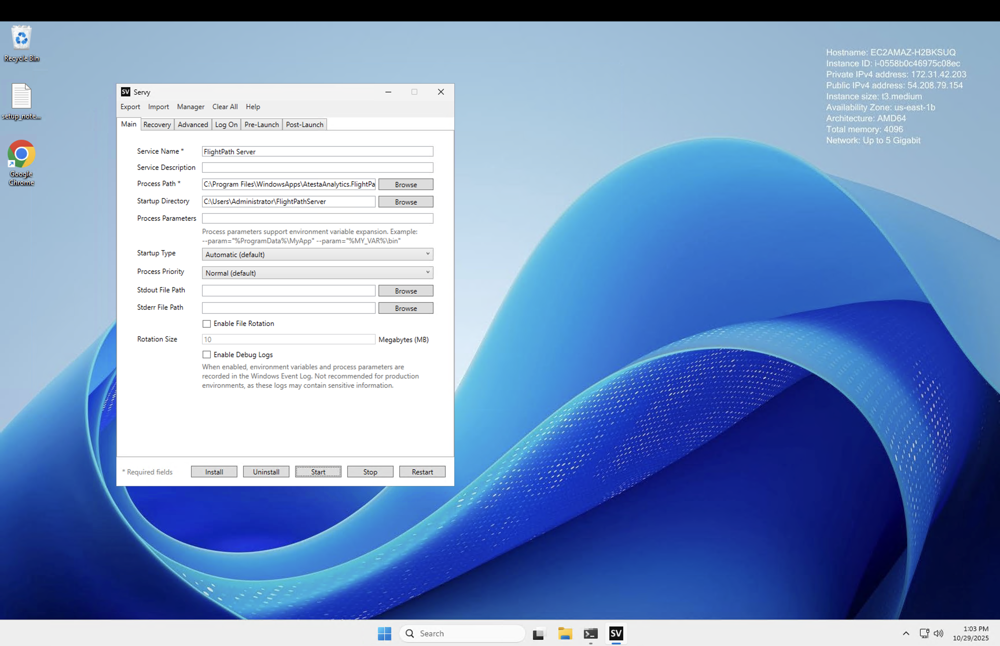
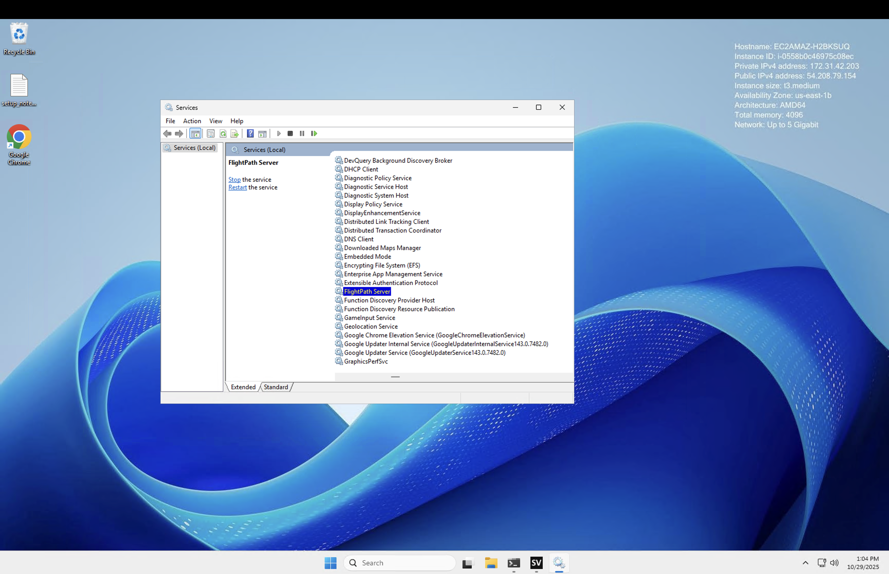
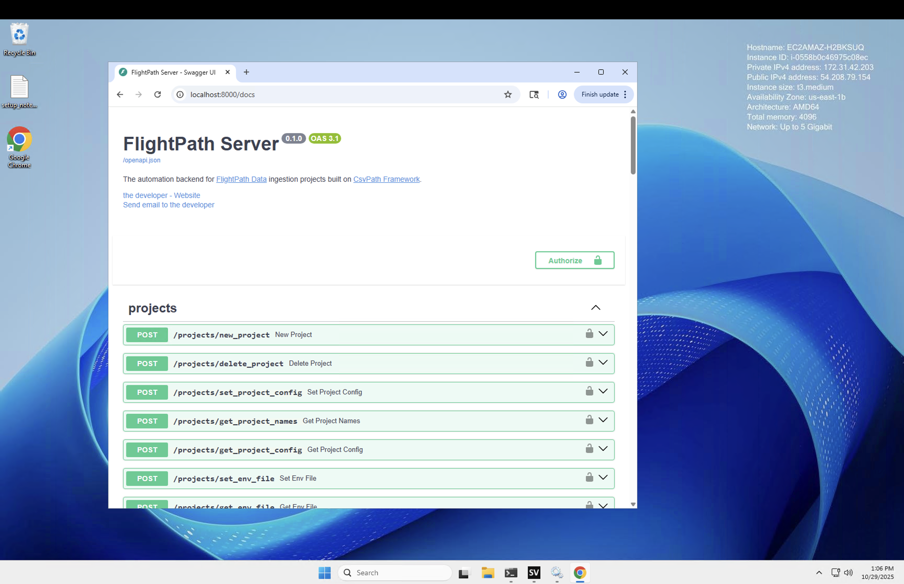

# ⚙️  Use Cases: FlightPath Server as a Windows Service
{: .no_toc }

## A background process for automation
{: .no_toc }
FlightPath Server was built for automation. For that purpose, it should be available at all times. On Windows that means running it as a Windows service.

Using an `.exe` as a service is common and easy. There are several ways to do it, including the Task Scheduler or `sc.exe` utility from Microsoft. Servy is another friendly option.

## Steps
{: .no_toc }

- TOC
{:toc}

### Install Servy
Follow the instructions on [Servy's GitHub site](https://servy-win.github.io/). Basically just open a command window and type: `winget install servy`.

Installing Servy using Winget. Scoop is another easy option.

{: .caption }

### Open Servy
Open the Servy app. There is one config form for creating a service. It has quite a few fields, but you only need:
* Service Name - anything you like, but `FlightPath Server` would be sensible
* Process Path - Something like: `C:\Program Files\WindowsApps\AtestaAnalytics.FlightPath\FlightPathServer.exe`
* Startup Directory - Something like: `C:\Users\Administrator\FlightPathServer`

Then click `Install` and you're done.

This is the only config form you need.

{: .caption }

### Check the service

Search for `services` and open the Services control panel. You should see your FlightPath Server service running.

The service should already be running. You can, of course, start, stop, and restart it here.

{: .caption }

And you can see the OpenAPI docs at http://localhost:8000/docs.

The service should already be running. You can, of course, start, stop, and restart it here.

{: .caption }

That's all there is to it.

